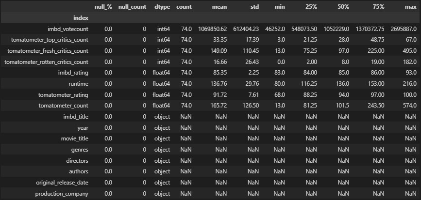
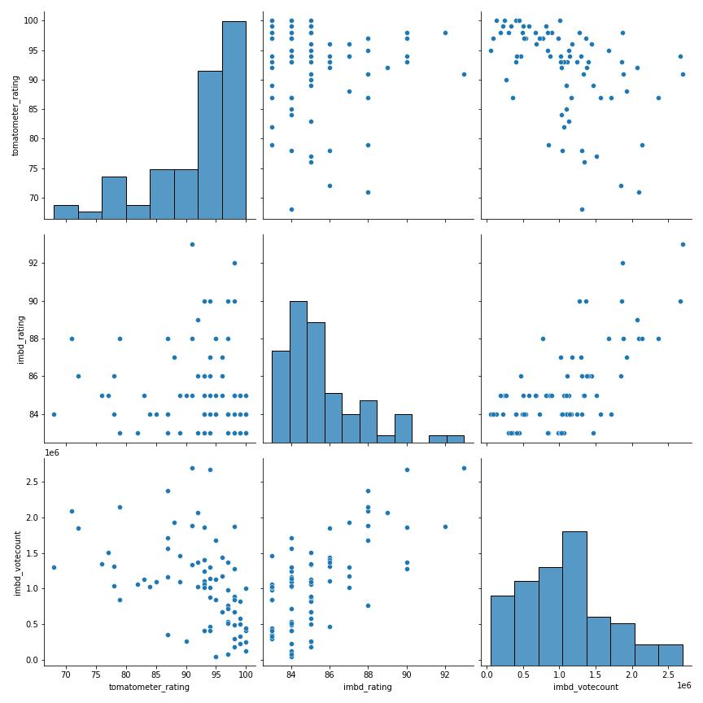
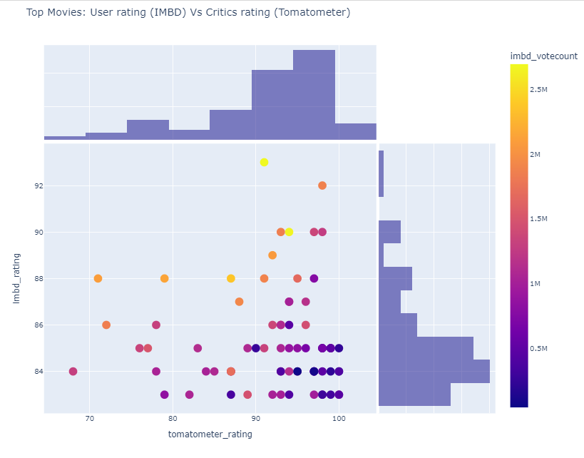

# Project: Data Pipeline

## <i> Audience vs Critics: Is the audience more picky in terms of their rating vs Critics? </i>

#### <b> In this project, we were asked to extract data from 2 different sources, creating an enriched dataset and perform EDA. I scraped an API using requests, in addition to using other complementary packages used Pandas, Numpy, Matplotlib, Seaborn , Difflib.

 
 

## Set up:

Modules --> stored in eda_cleaning.py and scraping.py
Report --> notebook.ipynb

## Main takeouts

The process is described within the notebook.

  

From the analytics point of view 

### Summary statistics for the main DF

- Result after the merge: 74/100 movies.
- the user rating (imbd_rating) average is considerably lower than the critics rating (tomatometer_rating)
- max user rating is 93, vs 100 from the critics
- the critics rating shows a higher dispersion

  

  

  

  

### Audience vs Critics: Is the audience more picky in terms of their rating vs Critics?

- the distribution of the audience rating (IMBD) vs the critic's rating (tomatometer) clearly show a different skew.
    - audience rating has a right skew (more concentration on the lower values) vs a left skew on the critics case.
- There seems to be a positive correlation between votecount and rating for the audience.
- The dispersion and mean values analyzed in the sumarry statistics are corroborated graphically.

#### This sample shows evidence that the audience might be more picky with their rating than critics, when evaluating all-time blockbusters.
